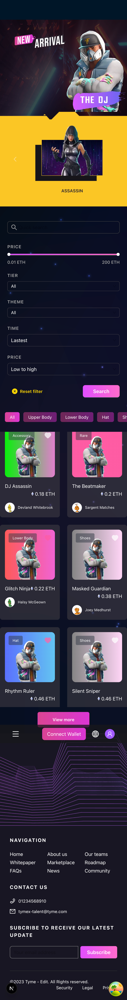

# Tymex Marketplace Frontend

## Quick Start

# Clone the repo
```bash
git clone https://github.com/neil-f-nguyen/tymex-frontent-interview-nguyenanhtu.git
cd tymex-interview-frontend-nguyenanhtu

# Install dependencies
npm install
# or
yarn install
```

## Development
```bash
npm run dev
# or
yarn dev
```
Visit: http://localhost:3000/marketplace

## Production Build
```bash
npm run build
npm start
# or
yarn build
yarn start
```

## Basic Commands
- `dev`: Start development server
- `build`: Build for production
- `start`: Run production server
- `lint`: Lint code
- `format`: Format code

## Folder Structure
```
src/
  app/          # Main pages (Next.js App Router)
  components/   # Reusable components
  styles/       # Global styles
  ...
```

## Demo


## Sample Backend Repo
You can use this sample backend for testing:
[Sample backend](./public/tymex-mock-server-nodejs-1_0.zip)

---
**Author:** Nguyen Anh Tu
